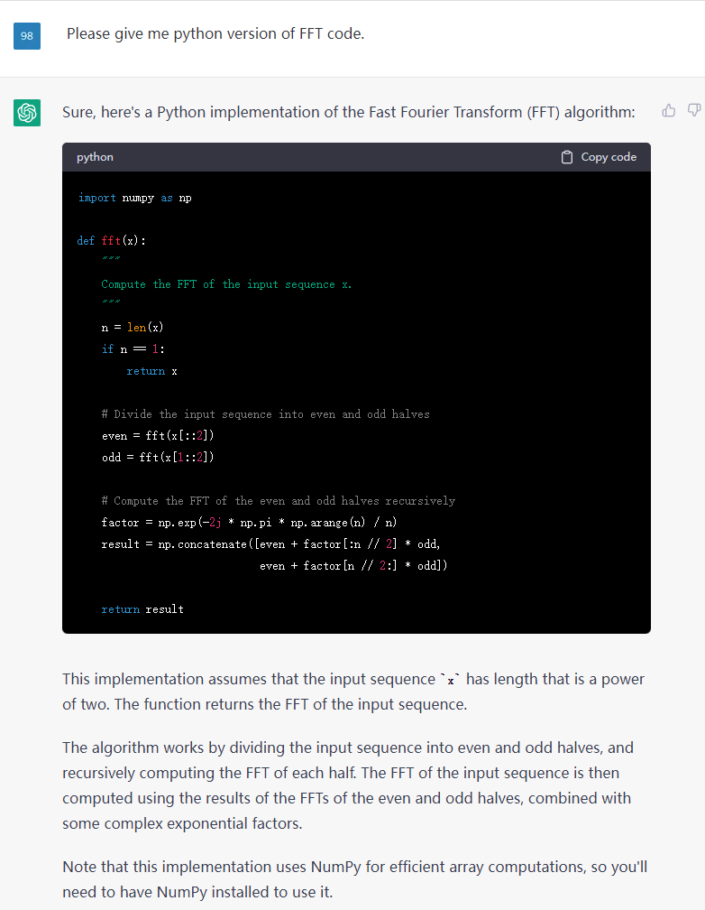
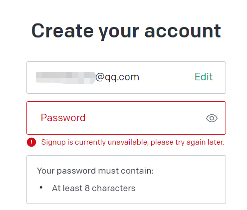
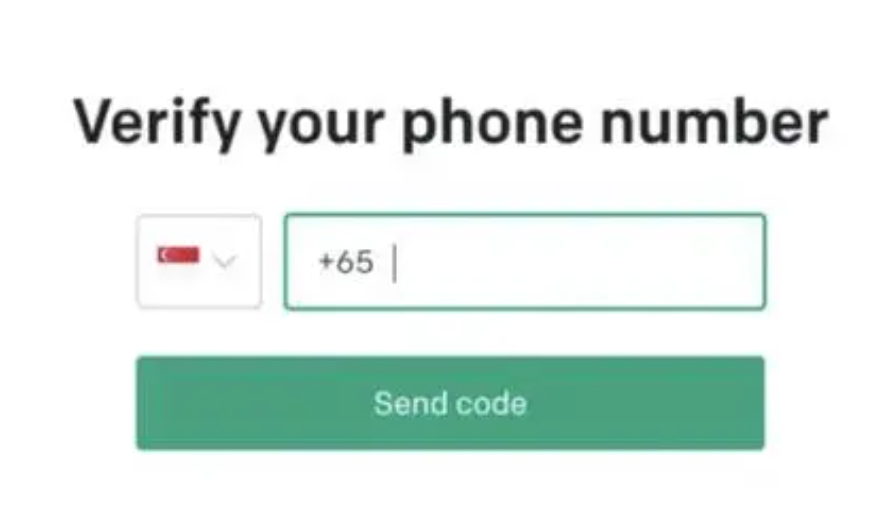
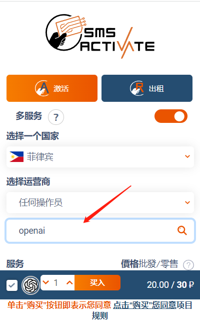
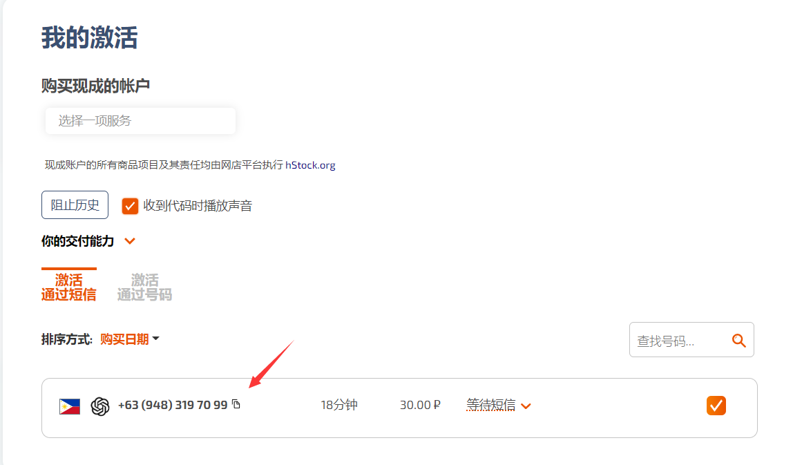
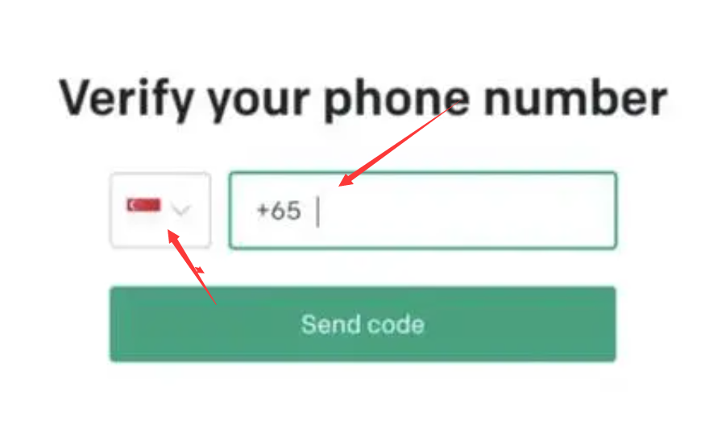
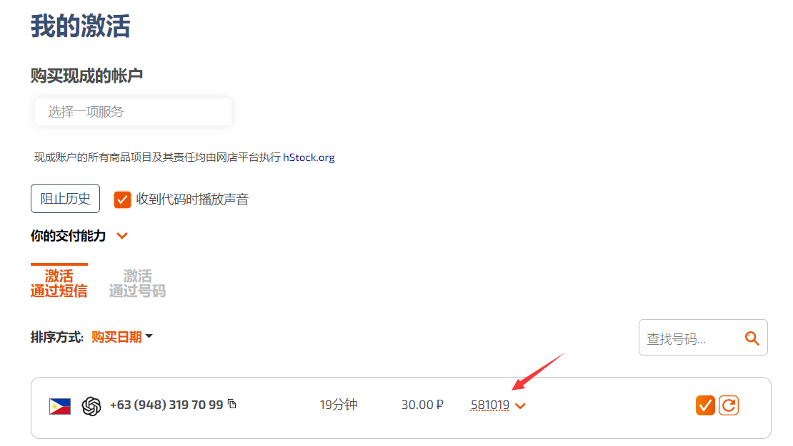
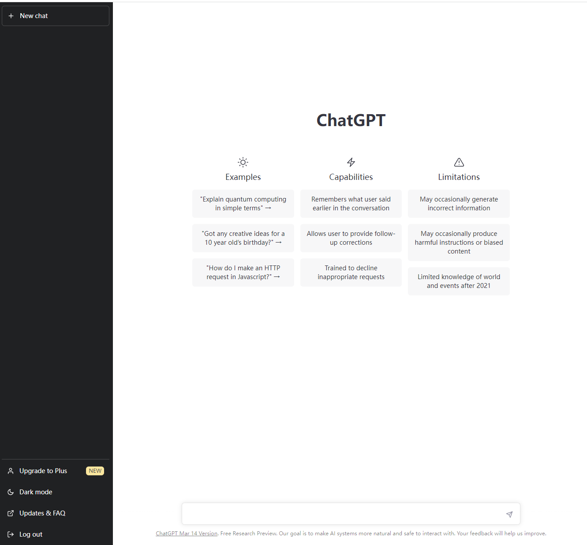

<H1>ChatGPT is all your need</H1>

<h3>Introduction</h3>
&emsp;&emsp;ChatGPT is an AI language model based on the GPT-3.5 architecture. It is a powerful toolkit that can greatly benefit our studies.Allow me use some examples to showcase its capabilities.

&emsp;&emsp;In the example above, ChatGPT can easily understand our requset and give us a reference answer.Most of the code in the answer can be run directly, a few may need to be modified to run. It can replace search engines in some ways(Usually search engines contain a lot of useless information).
&emsp;&emsp;For some reason, the ChatGPT is not available in China(include Hongkong,Macau and Taiwan). However they are ways to access it. Next I will provide a guide on how to use ChatGPT in china.
### Step 1:Tool Preparation
&emsp;&emsp;Choose a Internet node that is not in China. If you already done, you can skip to Step2.
&emsp;&emsp;If you don't konw how to get a Internet node. I recommend a software here (<https://moetor.one>), it's not free but cheap. You registration and use will not bring me any benefits, I recommend it just because it useful. After you download and install, choose a node and go to the next step.
### Step 2:Register an OpenAI Account
&emsp;&emsp;Open this link(<https://chat.openai.com/auth/login>) and click ==Sign up==.Follow the prompts to fill in the registration information. 
&emsp;&emsp;If you get the following error, the reason is that you use the QQ or 163 email. 

&emsp;&emsp;You can replace it with Google Mail. Note, don't use phone number in China when you registering Google that will cause your account unusable.
&emsp;&emsp;Now log in with your account, and you will see that you need to verify your phone number. 

&emsp;&emsp;You need a non-Chinese phone number. <https://sms-activate.org/> This link provide virtual phone number service and support Alipay. 
&emsp;&emsp;After registering an account,select a country(prices vary by country) and search for openai services on the right side.Click buy.

 

&emsp;&emsp;Then you will get a virtual phone number.Copy it on the phone number verification page and click send code.Note that the selected country should be the same as the country of your mobile phone number

 

 

&emsp;&emsp;After about 30s, you will get a verification code.Copy and paste it.

 

&emsp;&emsp;If your steps are correct,now ChatGPT is available.

 

